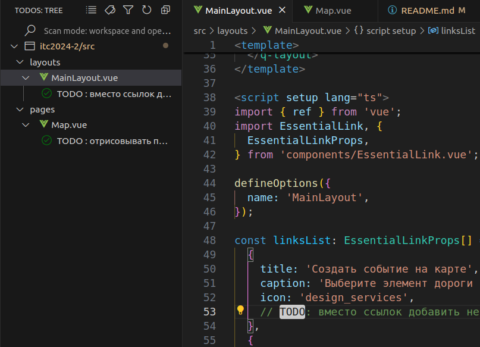

# Описание

**Советую установить https://vscode.dev/github/nick-bkwp/itc2024-2-front/blob/mastere/extension и использовать todo для планирования**

## Страницы

- [Карта](http://localhost:9000/#/map)

основная и единственная страница. содержит контент

## Компоненты

- Попап

_в разработке_

отображает краткую информацию о сущности на карте

## Хуки

- useMap

инициализирует и фокусирует карту по id контейнера

- usePoint

создает точку
